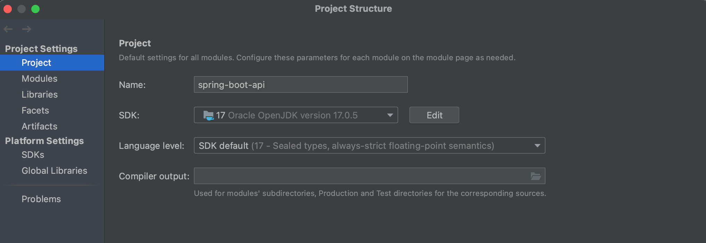

# REST API with Spring Boot

- H2 Database
    - http://localhost:8080/h2-console

## Endpoints

`GET /v1/greetings/:name`

```bash
curl -i 'http://localhost:8080/v1/greetings/9sako6'
```

`POST /v1/courses`

```bash
curl -i -d '{"id":null,"name":"Build Restful APIs using Kotlin and SpringBoot","category":"Development"}' -H "Content-Type: application/json" -X POST 'http://localhost:8080/v1/courses'
```

`GET /v1/courses`

```bash
curl -i 'http://localhost:8080/v1/courses'
```

`PUT /v1/courses/:course_id`

```bash
curl -i -d '{"id":null,"name":"Build Restful APIs using Kotlin & SpringBoot2","category":"Development"}' -H "Content-Type: application/json" -X PUT 'http://localhost:8080/v1/courses/1'
```

`DELETE /v1/courses/:course_id`

```bash
curl -i -X DELETE 'http://localhost:8080/v1/courses/1'
```

## Q&A

### What is DTO?

### What is springmockk?

### What is `lateinit var`?

### `@` をつける記法の意味は？

### What is `@WebMvcTest`?

### What is `@AutoConfigureWebTestClient`?

### What is `@MockkBean`?

### What is `@Autowired`?

### What is `@Test`?

### What is `@GeneratedValue(strategy = GenerationType.AUTO)`?

主キーが自動生成されて DB に保存される。

### ID はいつの間に振られているの？

```kotlin
    fun addCourse(courseDTO: CourseDTO): CourseDTO {
    val courseEntity = courseDTO.let {
        Course(null, it.name, it.category)
    }
    courseRepository.save(courseEntity)

    logger.info("Save course is : $courseEntity")

    return courseEntity.let {
        CourseDTO(it.id, it.name, it.category) // here
    }
}
```

### What is `@DataJpaTest`?

## Troubleshooting

### `java.lang.UnsupportedClassVersionError`

ランタイムとして Java 17 (61) を期待しているけど、58 で動かそうとしてると言われている。

```bash
エラー: メイン・クラスcom.kotlinspring.coursecatalogservice.CourseCatalogServiceApplicationKtのロード中にLinkageErrorが発生しました
	java.lang.UnsupportedClassVersionError: com/kotlinspring/coursecatalogservice/CourseCatalogServiceApplicationKt has been compiled by a more recent version of the Java Runtime (class file version 61.0), this version of the Java Runtime only recognizes class file versions up to 58.0

Process finished with exit code 1
```

Mac ユーザーわしは https://www.oracle.com/java/technologies/downloads/#jdk17-mac から Java 17 をダウンロードしてインストールして解決した。
InteliJ を使っている場合はプロジェクトで Java 17 を使うように設定する必要がある。



#### References

- [How to Fix UnsupportedClassVersion Error in Java | Rollbar](https://rollbar.com/blog/java-unsupportedclassversionerror/)

### `java.lang.IllegalStateException`

```bash
11:18:02.395 [main] DEBUG org.springframework.test.context.BootstrapUtils - Instantiating CacheAwareContextLoaderDelegate from class [org.springframework.test.context.cache.DefaultCacheAwareContextLoaderDelegate]
11:18:02.402 [main] DEBUG org.springframework.test.context.BootstrapUtils - Instantiating BootstrapContext using constructor [public org.springframework.test.context.support.DefaultBootstrapContext(java.lang.Class,org.springframework.test.context.CacheAwareContextLoaderDelegate)]
11:18:02.432 [main] DEBUG org.springframework.test.context.BootstrapUtils - Instantiating TestContextBootstrapper for test class [integration.com.kotlinspring.coursecatalogservice.controller.GreetingControllerIntegrationTests] from class [org.springframework.boot.test.context.SpringBootTestContextBootstrapper]
11:18:02.443 [main] INFO org.springframework.boot.test.context.SpringBootTestContextBootstrapper - Neither @ContextConfiguration nor @ContextHierarchy found for test class [integration.com.kotlinspring.coursecatalogservice.controller.GreetingControllerIntegrationTests], using SpringBootContextLoader
11:18:02.446 [main] DEBUG org.springframework.test.context.support.AbstractContextLoader - Did not detect default resource location for test class [integration.com.kotlinspring.coursecatalogservice.controller.GreetingControllerIntegrationTests]: class path resource [integration/com/kotlinspring/coursecatalogservice/controller/GreetingControllerIntegrationTests-context.xml] does not exist
11:18:02.446 [main] DEBUG org.springframework.test.context.support.AbstractContextLoader - Did not detect default resource location for test class [integration.com.kotlinspring.coursecatalogservice.controller.GreetingControllerIntegrationTests]: class path resource [integration/com/kotlinspring/coursecatalogservice/controller/GreetingControllerIntegrationTestsContext.groovy] does not exist
11:18:02.446 [main] INFO org.springframework.test.context.support.AbstractContextLoader - Could not detect default resource locations for test class [integration.com.kotlinspring.coursecatalogservice.controller.GreetingControllerIntegrationTests]: no resource found for suffixes {-context.xml, Context.groovy}.
11:18:02.447 [main] INFO org.springframework.test.context.support.AnnotationConfigContextLoaderUtils - Could not detect default configuration classes for test class [integration.com.kotlinspring.coursecatalogservice.controller.GreetingControllerIntegrationTests]: GreetingControllerIntegrationTests does not declare any static, non-private, non-final, nested classes annotated with @Configuration.

Test ignored.

java.lang.IllegalStateException: Unable to find a @SpringBootConfiguration, you need to use @ContextConfiguration or @SpringBootTest(classes=...) with your test

	at org.springframework.util.Assert.state(Assert.java:76)
	at org.springframework.boot.test.context.SpringBootTestContextBootstrapper.getOrFindConfigurationClasses(SpringBootTestContextBootstrapper.java:236)
	at org.springframework.boot.test.context.SpringBootTestContextBootstrapper.processMergedContextConfiguration(SpringBootTestContextBootstrapper.java:152)
	at org.springframework.test.context.support.AbstractTestContextBootstrapper.buildMergedContextConfiguration(AbstractTestContextBootstrapper.java:393)
	at org.springframework.test.context.support.AbstractTestContextBootstrapper.buildDefaultMergedContextConfiguration(AbstractTestContextBootstrapper.java:309)
	at org.springframework.test.context.support.AbstractTestContextBootstrapper.buildMergedContextConfiguration(AbstractTestContextBootstrapper.java:262)
	at org.springframework.test.context.support.AbstractTestContextBootstrapper.buildTestContext(AbstractTestContextBootstrapper.java:107)
	at org.springframework.boot.test.context.SpringBootTestContextBootstrapper.buildTestContext(SpringBootTestContextBootstrapper.java:102)
	at org.springframework.test.context.TestContextManager.<init>(TestContextManager.java:137)
	at org.springframework.test.context.TestContextManager.<init>(TestContextManager.java:122)
	at org.junit.jupiter.engine.execution.ExtensionValuesStore.lambda$getOrComputeIfAbsent$4(ExtensionValuesStore.java:86)
	at org.junit.jupiter.engine.execution.ExtensionValuesStore$MemoizingSupplier.computeValue(ExtensionValuesStore.java:223)
	at org.junit.jupiter.engine.execution.ExtensionValuesStore$MemoizingSupplier.get(ExtensionValuesStore.java:211)
	at org.junit.jupiter.engine.execution.ExtensionValuesStore$StoredValue.evaluate(ExtensionValuesStore.java:191)
	at org.junit.jupiter.engine.execution.ExtensionValuesStore$StoredValue.access$100(ExtensionValuesStore.java:171)
	at org.junit.jupiter.engine.execution.ExtensionValuesStore.getOrComputeIfAbsent(ExtensionValuesStore.java:89)
	at org.junit.jupiter.engine.execution.ExtensionValuesStore.getOrComputeIfAbsent(ExtensionValuesStore.java:93)
	at org.junit.jupiter.engine.execution.NamespaceAwareStore.getOrComputeIfAbsent(NamespaceAwareStore.java:61)
	at org.springframework.test.context.junit.jupiter.SpringExtension.getTestContextManager(SpringExtension.java:294)
	at org.springframework.test.context.junit.jupiter.SpringExtension.beforeAll(SpringExtension.java:113)
	at org.junit.jupiter.engine.descriptor.ClassBasedTestDescriptor.lambda$invokeBeforeAllCallbacks$10(ClassBasedTestDescriptor.java:381)
	at org.junit.platform.engine.support.hierarchical.ThrowableCollector.execute(ThrowableCollector.java:73)
	at org.junit.jupiter.engine.descriptor.ClassBasedTestDescriptor.invokeBeforeAllCallbacks(ClassBasedTestDescriptor.java:381)
	at org.junit.jupiter.engine.descriptor.ClassBasedTestDescriptor.before(ClassBasedTestDescriptor.java:205)
	at org.junit.jupiter.engine.descriptor.ClassBasedTestDescriptor.before(ClassBasedTestDescriptor.java:80)
	at org.junit.platform.engine.support.hierarchical.NodeTestTask.lambda$executeRecursively$6(NodeTestTask.java:148)
	at org.junit.platform.engine.support.hierarchical.ThrowableCollector.execute(ThrowableCollector.java:73)
	at org.junit.platform.engine.support.hierarchical.NodeTestTask.lambda$executeRecursively$8(NodeTestTask.java:141)
	at org.junit.platform.engine.support.hierarchical.Node.around(Node.java:137)
	at org.junit.platform.engine.support.hierarchical.NodeTestTask.lambda$executeRecursively$9(NodeTestTask.java:139)
	at org.junit.platform.engine.support.hierarchical.ThrowableCollector.execute(ThrowableCollector.java:73)
	at org.junit.platform.engine.support.hierarchical.NodeTestTask.executeRecursively(NodeTestTask.java:138)
	at org.junit.platform.engine.support.hierarchical.NodeTestTask.execute(NodeTestTask.java:95)
	at java.base/java.util.ArrayList.forEach(ArrayList.java:1511)
	at org.junit.platform.engine.support.hierarchical.SameThreadHierarchicalTestExecutorService.invokeAll(SameThreadHierarchicalTestExecutorService.java:41)
	at org.junit.platform.engine.support.hierarchical.NodeTestTask.lambda$executeRecursively$6(NodeTestTask.java:155)
	at org.junit.platform.engine.support.hierarchical.ThrowableCollector.execute(ThrowableCollector.java:73)
	at org.junit.platform.engine.support.hierarchical.NodeTestTask.lambda$executeRecursively$8(NodeTestTask.java:141)
	at org.junit.platform.engine.support.hierarchical.Node.around(Node.java:137)
	at org.junit.platform.engine.support.hierarchical.NodeTestTask.lambda$executeRecursively$9(NodeTestTask.java:139)
	at org.junit.platform.engine.support.hierarchical.ThrowableCollector.execute(ThrowableCollector.java:73)
	at org.junit.platform.engine.support.hierarchical.NodeTestTask.executeRecursively(NodeTestTask.java:138)
	at org.junit.platform.engine.support.hierarchical.NodeTestTask.execute(NodeTestTask.java:95)
	at org.junit.platform.engine.support.hierarchical.SameThreadHierarchicalTestExecutorService.submit(SameThreadHierarchicalTestExecutorService.java:35)
	at org.junit.platform.engine.support.hierarchical.HierarchicalTestExecutor.execute(HierarchicalTestExecutor.java:57)
	at org.junit.platform.engine.support.hierarchical.HierarchicalTestEngine.execute(HierarchicalTestEngine.java:54)
	at org.junit.platform.launcher.core.EngineExecutionOrchestrator.execute(EngineExecutionOrchestrator.java:107)
	at org.junit.platform.launcher.core.EngineExecutionOrchestrator.execute(EngineExecutionOrchestrator.java:88)
	at org.junit.platform.launcher.core.EngineExecutionOrchestrator.lambda$execute$0(EngineExecutionOrchestrator.java:54)
	at org.junit.platform.launcher.core.EngineExecutionOrchestrator.withInterceptedStreams(EngineExecutionOrchestrator.java:67)
	at org.junit.platform.launcher.core.EngineExecutionOrchestrator.execute(EngineExecutionOrchestrator.java:52)
	at org.junit.platform.launcher.core.DefaultLauncher.execute(DefaultLauncher.java:114)
	at org.junit.platform.launcher.core.DefaultLauncher.execute(DefaultLauncher.java:86)
	at org.junit.platform.launcher.core.DefaultLauncherSession$DelegatingLauncher.execute(DefaultLauncherSession.java:86)
	at org.junit.platform.launcher.core.SessionPerRequestLauncher.execute(SessionPerRequestLauncher.java:53)
	at com.intellij.junit5.JUnit5IdeaTestRunner.startRunnerWithArgs(JUnit5IdeaTestRunner.java:57)
	at com.intellij.rt.junit.IdeaTestRunner$Repeater$1.execute(IdeaTestRunner.java:38)
	at com.intellij.rt.execution.junit.TestsRepeater.repeat(TestsRepeater.java:11)
	at com.intellij.rt.junit.IdeaTestRunner$Repeater.startRunnerWithArgs(IdeaTestRunner.java:35)
	at com.intellij.rt.junit.JUnitStarter.prepareStreamsAndStart(JUnitStarter.java:235)
	at com.intellij.rt.junit.JUnitStarter.main(JUnitStarter.java:54)


Process finished with exit code 255
```

main と test にあるパッケージのディレクトリ構造を同じにすると解決した。

```bash
$ tree src/main/kotlin/                                                                                                                                                                                  +[main]
src/main/kotlin/
└── com
    └── kotlinspring
        ├── CourseCatalogServiceApplication.kt
        ├── controller
        │   └── GreetingController.kt
        └── service
            └── GreetingService.kt

4 directories, 3 files
$ tree src/test/kotlin/                                                                                                                                                                                  +[main]
src/test/kotlin/
└── com
    └── kotlinspring
        ├── CourseCatalogServiceApplicationTests.kt
        └── controller
            └── GreetingControllerIntegrationTests.kt

3 directories, 2 files

```

### H2 のコンソールで接続できない

```text
Database "/Users/9sako6/test" not found, either pre-create it or allow remote database creation (not recommended in secure environments) [90149-214] 90149/90149 (Help)
```

https://stackoverflow.com/a/67950919 の通りに `~/test.mv.db` を作ったら接続できるようにはなった。
しかし、`COURSES` テーブルが作られていない。

上記は間違いで、コンソールの JDBC URL に application.yaml で設定した `jdbc:h2:mem:testdb` を入れる必要があった。

## References

- [Spring Data JPA - Reference Documentation](https://docs.spring.io/spring-data/jpa/docs/current/reference/html/#jpa.query-methods.query-creation)